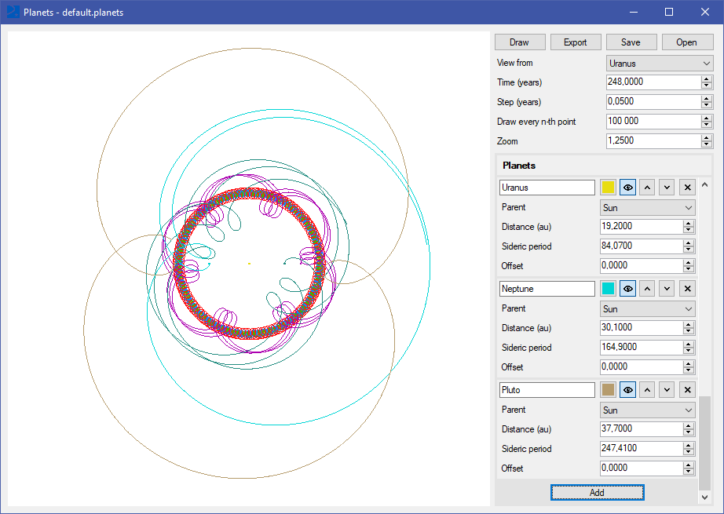

# Relative planet paths visualizer

This app allows visualizing relative paths of planets (or other cellestial bodies, such as moons or stars), with one of them being the "center" or point of view.
I developed this app in highschool, inspired by a physics/astronomics class.

## Features
- Add different cellestial bodies and set their parameters, such as distance from its parent and sideric period.
- Set relationships between cellestial bodies (who is orbiting who). Relationships can be nested, for example Earth orbits the Sun and the Moon orbits Earth.
- View the same configuration with different bodies as the center/point of view.
- Save your planet configuration to a file or load your saved planets from a file.
- Export the visualization as an image (PNG or BMP).

## Limiations
- The app assumes all orbits of cellestial bodies are circles
 with the orbited body at the center
- Only supports exporting to bitmap image formats
- Runs only on Windows

## Used technologies
- C#
- Winforms

